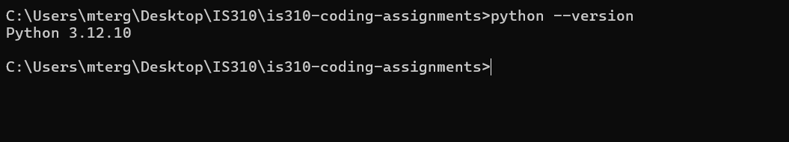
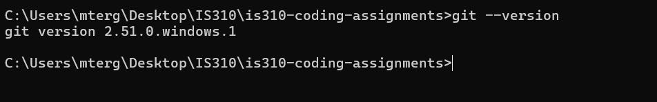
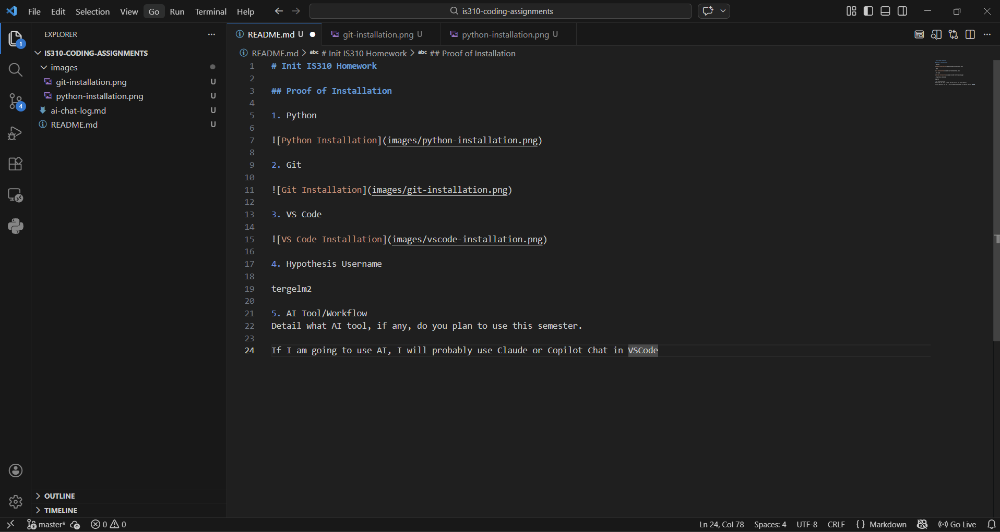

# Init IS310 Homework

## Proof of Installation

1. Python

2. Git

3. VS Code

4. Hypothesis Username

tergelm2

5. AI Tool/Workflow
Detail what AI tool, if any, do you plan to use this semester.

If I am going to use AI, I will probably use Claude or Copilot Chat in VSCode